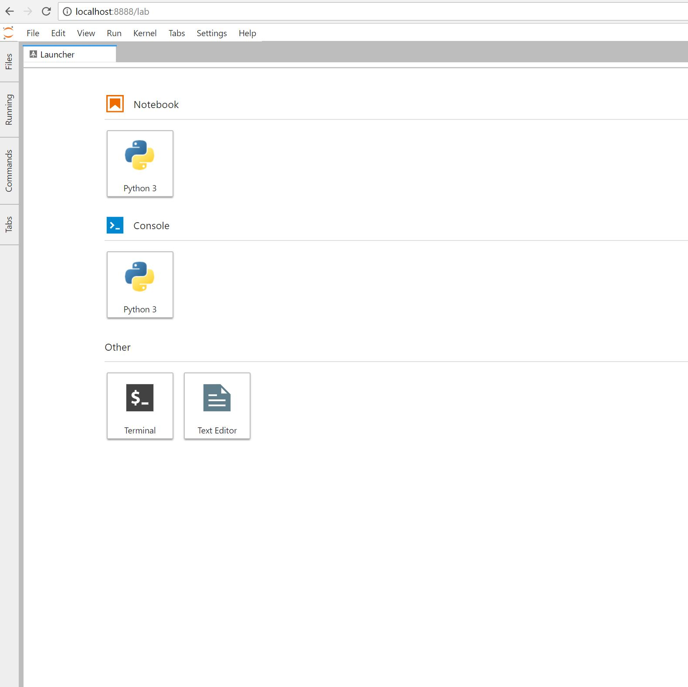

# Environment setup

In this step you will prepare the lab environment, including Custom Vision Service project and Custom Vision Service SDK. 

## Provision Cognitive Services

### Provision Custom Vision Service
We will use Azure Portal to provision Custom Vision service.
1. Navigate and login to Azure portal

https://portal.azure.com

2. Navigate to Custom Vision blade


3. Press `Create` button


4. Complet the form. Use `F0` plan for both prediction and training tiers. Note that the service is only available in South Central US region


5. Navigate to Custom Vision portal at

https://customvision.ai

6. Login using the same account you used to login to Azure Portal. You should see the following screen


## Install Custom Vision SDK
As indicated in the workshop prerequisities you should have Anaconda for Python 3 pre-installed. If you don't, know is the time.
If you prefer you can create `conda` environment to run the SDK in a sandbox.

```
pip install azure-cognitiveservices-vision-customvision
```

## Clone the workshop's repo
Clone the workshop's repo in your preferred location
```
git clone https://github.com/jarokaz/CognitiveServicesWorkshop.git
```

## Verify that you can start and connect to Jupyter Lab 
Start Jupyter Lab from the root folder of the workshop's repo
```
jupyter lab
```
Connect to Jupyter Lab
Verify that you can see this screen



Press `Ctrl-C` to kill the Jupyter session.

Congratulations. Your environment is ready.


