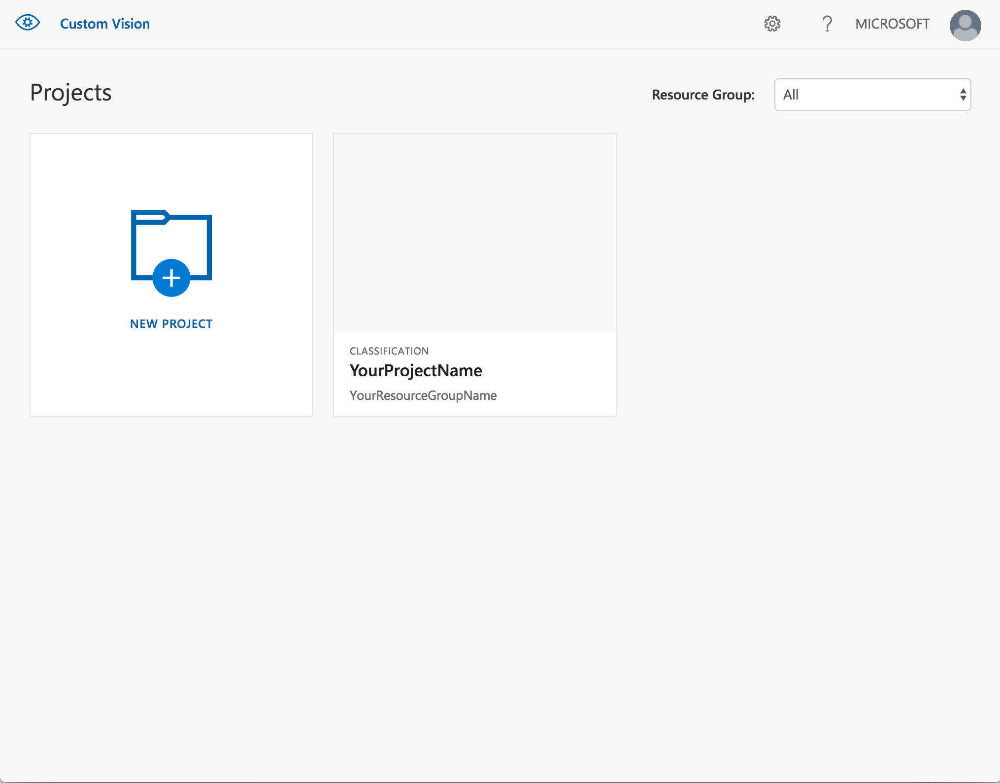
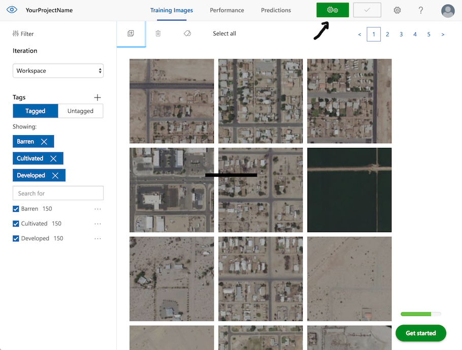
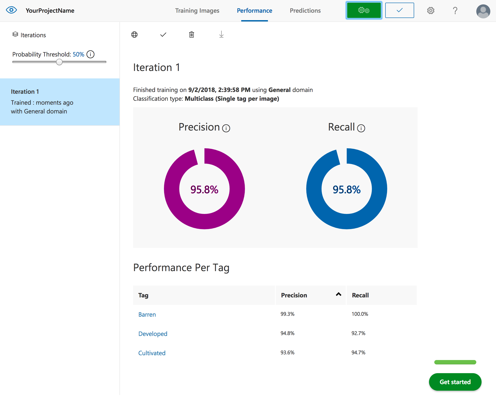

# Train
In this step you will train, evaluate, and fine tune a custom image classification model using Custom Vision Service Web GUI. It is also possible to script the modelling workflow using Custom Vision Service SDK. Refer to the below link for more information:

https://docs.microsoft.com/en-us/azure/cognitive-services/custom-vision-service/python-tutorial

## Upload and tag training images
1. Navigate to the project section of Custom Vision Service Web GUI.

https://customvision.ai/projects

2. Click on the project you created in the lab set up step.

3. To add the first set of images to your project, use the *Add* images button. Navigate to `<MTC_AzureAILabs root/Datasets/AerialSmall/train/Barren` and select and add all images.

4. To set the tag, enter *Barren* in the My Tags field. 

5. Repeat for images in `Cultivated` and `Developed` subfolder, using the respective tags.

## Train and evaluate the first iteration of the model
1. To train the classifier, click on the *Train* button.

2. After training is completed you will see the screen with the evaluation metrics. The instructor will explain who to interpret the metrics.

## Test your model
1. From the Custom Vision web page, select your project. Select Quick Test on the right of the top menu bar. This action opens a window labeled Quick Test.
2. In the Quick Test window, click in the Submit Image field and enter the URL of the image you want to use for your test. If you want to use a locally stored image instead, click the Browse local files button and select a local image file.

3. Repeat the test for another image

## Use SDK to programmatically train and evaluate models

